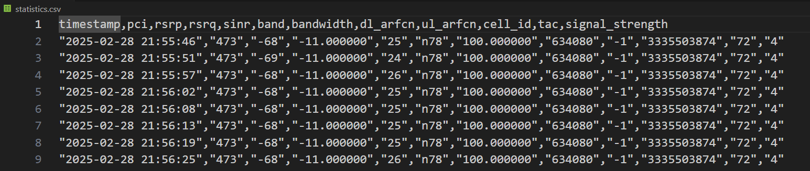
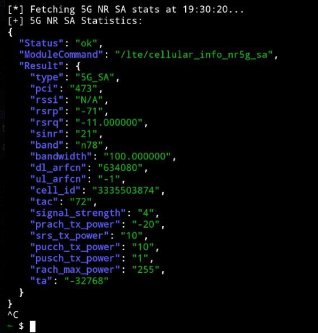
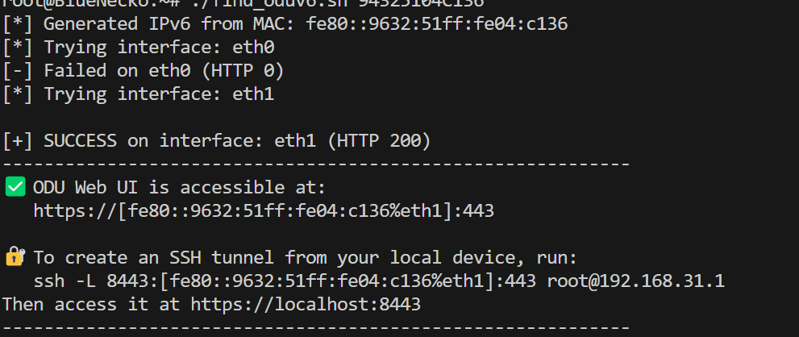

| sr.No | Name                                                           | author            |
| ----- | -------------------------------------------------------------- | ----------------- |
| 01    | [Root enabler for Extender/IDU](#root-enabler-for-extenderidu) | @Viraniac         |
| 02    | [Network stats logger for ODU](#network-stats-logger-for-odu)  | @BlueNecko        |
| 03    | [Opensync disabler](#opensync-disabler)                        | @Xumi59,BlueNecko |
| 04    | [ODU Local link generator](#odu-local-link-generator)          | @timeisexpensivee |

## Root enabler for Extender/IDU
### script: [enableRootSSH](scripts/enableRootSSH.sh)
This is an alternate method for rooting, alt to the OG manual method of editing the files. This has been tested with few models such as Extenders and idu6801. Although it should work the same for every other idu too, but it isn't confirmed yet. 

## Network stats logger for ODU
This script works by utilizing the restful api endpoints provided by the odu. These are the stats which you can see in the webui of the odu, but in a very raw form which can be utilized for studying the network fluctuations and uptime. If your odu doesn't use restfull api's the data can still be captured but you will have to write the script for that.

The script is supposed to run on any device (primarily idu) which is connected to the odu via an ether link. The script does automatic auth given it knows the salt and the hashed password. 
##### Note: password automation is still under development and for now needs manual hash capture 

### script: [odu_stats.sh](scripts/odu_stats.sh)
You needs to edit the site, api, login and filepath variables before executing. The script will save the data in a .csv file in the following format.

### script:  [odu_stats_live.sh](scripts/odu_stats_live.sh)
This script is supposed to be ran live to help with odu mounting and alignment(it's barebone for now)


### Formatting and graph plots
These are simple python scripts which will plot graphs for you, for now only few are there, more may or may not be added in future.  

### script: [relation.py](scripts/realation.py) 


## Opensync disabler
services to be disabled on startup - healthcheck, opensync, jioWifiManagerStartup, jioDscpPriority, jioWifiNotifierStartup, jioWifiLoggerStartup

script changes - /etc/init.d/plumeConfigMerge , /etc/init.d/platformConfigMerge, /etc/init.d/opensync

### Changes made to startup scripts 
Note: Changes have been marked with `###` comments, only the part of the file that has been changed is shown, rest of the file isnt shown.
1. plumeConfigMerge
```sh
#!/bin/sh /etc/rc.common

# Copyright© 2023 Jio Platforms Ltd.

START=14

PlumeEnabled="0"  ### changes to 0 for plume disabled

if [ -f "/usr/opensync/bin/dm" ]; then
    PlumeEnabled="0"   ### changes to 0 for plume disabled
fi

if [ "$PlumeEnabled" = "0" ]; then  ### changes to 0 for plume disabled
    network_brlanuci q get network.brlan

    if [ -n "$network_brlan" ]; then
            ######### For network config file changes ###########                uci delete network.brlan
            rule_name=$(uci -q add network switch)
            uci batch << EOF
            set network.$rule_name.name=switch
            set network.$rule_name.name=switch0
            set network.$rule_name.reset=1
```

2. platformConfigMerge
```sh
#!/bin/sh /etc/rc.common

# Copyright© 2023 Jio Platforms Ltd.

START=15

PlumeEnabled="0"

if [ -f "/usr/opensync/bin/dm" ]; then 
    PlumeEnabled="0"   ### changes to 0 for plume disabled
fi

######## Plume disabled, update network and dhcp config file #***
if [ "$PlumeEnabled" = "0" ]; then
    config_network='uci -q get network.brlan.name

    if [ -z "$config_network" ]; then
        uci delete network.@switch_vlan[2]
        uci delete network.@switch_vlan[1]
        uci delete network.@switch_vlan[0]
        uci delete network.@switch[0]
        uci set network.brlan="device"
        uci set network.brlan.name='br-lan'
    fi
fi

```

3. opensync
```sh
#!/bin/sh -e
INSTALL_PREFIX=/usr/opensync 
        
START=99
                          
PID_FILE=/var/run/dm.pid     
BIN_DIR=${INSTALL_PREFIX}/bin

opensync_service_enabled()
{       
    false ### changed to false to disable opensync
}       

opensync_post_start()
{
        ${INSTALL_PREFIX}/bin/ipmond &
}       
```

Note: script is underwork, anything can go wrong, so do not be dumb.
### script: [opensync_disabler](scripts/opensync_disabler.sh)


## ODU Local link generator
This script works on principle of ipv6 local-link address generation using the mac address of ODU
Converts a MAC address (e.g., 00:06:AE:A3:AE:90) to IPv6 link-local (EUI-64)
Ensure MAC is lowercase and colon-separated


### script: [find_oduv6](scripts/find_oduv6.sh)