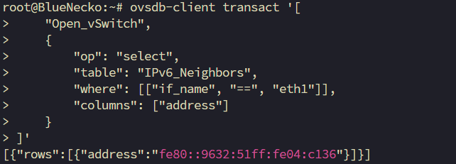
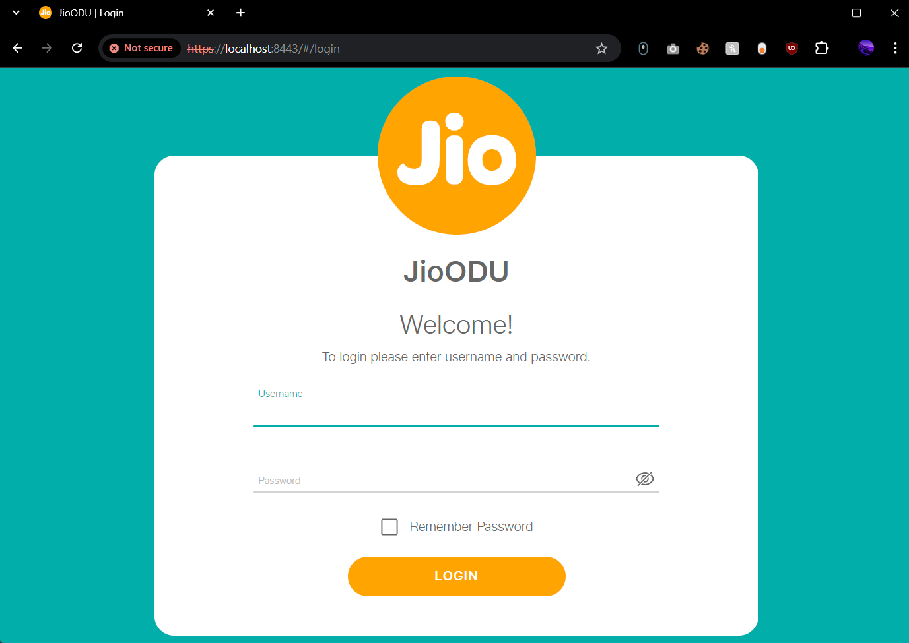

# Accessing the ODU WEB-UI from local network

_Disclaimer: This is ONLY for educational purposes, No one is responsible for any type of damage. So be aware._

1. Fetch the local link ip of the ODU using this command:

    ```shell
    ovsdb-client transact '[ 
        "Open_vSwitch", 
        {
            "op": "select",
            "table": "IPv6_Neighbors",
            "where": [["if_name", "==", "eth1"]],
            "columns": ["address"]
        }
    ]'
    ```

    

    _NOTE: If you don't get an ipv6 address in return then try restarting your router once. That should fix the issue most of the times if you haven't messed around the settings to much. If the issue still persists then reset the router and try again._

2. Start a SSH tunnel from any local device:

    ```shell
    ssh -L 8443:[<local-link-ipv6-address>]:443 root@192.168.31.1
    ```

    * Substitute the local link ip with what you get as output from previous command. For example:

        ```shell
        ssh -L 8443:[fe80::9632:51ff:fe04:c136%eth1]:443 root@192.168.31.1
        ```

3. Access ODU via `https://localhost:8443`:

    
